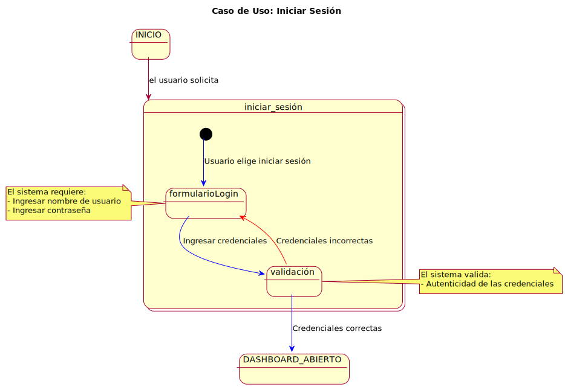
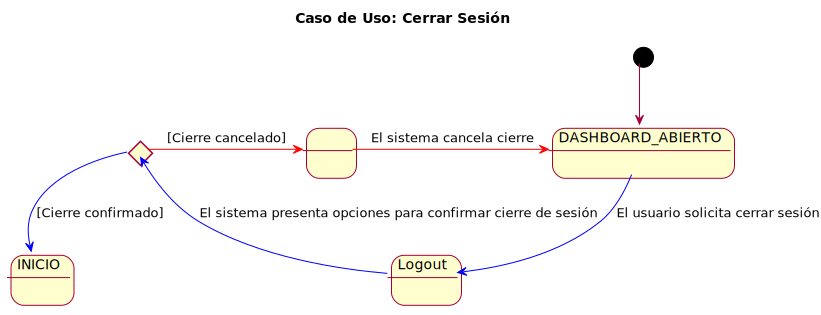
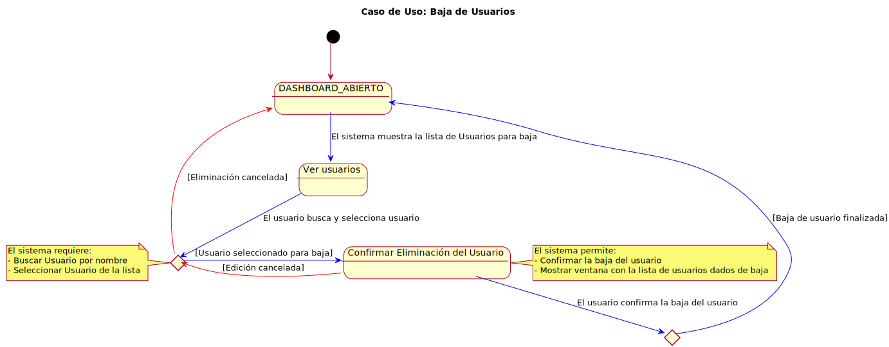
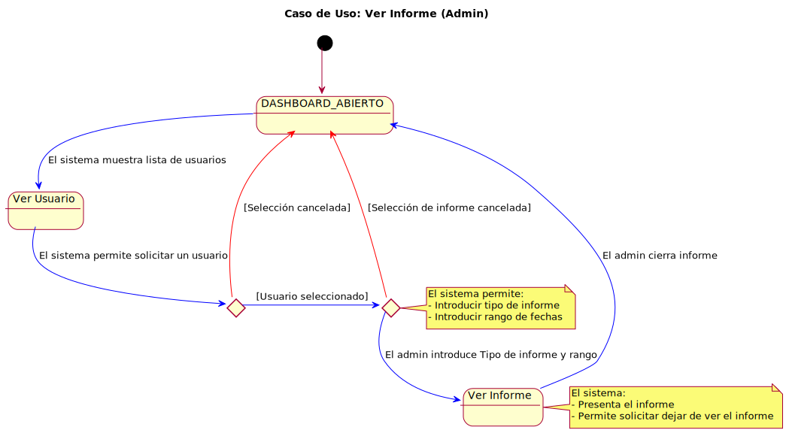

Este documento presenta los casos de uso identificados para nuestro proyecto, clasificados por actores y detallados con diagramas y códigos correspondientes. Nuestro enfoque principal es la gestión de fichajes y el seguimiento del tiempo.

## Índice
1. [Actores y Casos de Uso](#actores-y-casos-de-uso)
2. [Detalles de los Casos de Uso](#detalles-de-los-casos-de-uso)
3. [Diagramas de Contexto](#diagramas-de-contexto)

## Actores y Casos de Uso

### Actores Identificados
- **Usuario**
- **Administrador**

### Casos de Uso por Actor
#### Usuario
- Ver Fichaje Diario
- Ver Informe

#### Administrador
- Ver Usuarios
- Editar Usuario
- Añadir Usuario
- Dar de Baja a Usuario
- Ver Informe

#### Diagrama General de Casos de Uso
  
[Código PUML](../../modelosUML/casosDeUso/casosDeUso.puml)

---

## Detalles de los Casos de Uso

### Login y Logout

Detalle de Login

| Visualización | Código |
| :---: | :---: |
|  | [Código PUML](../../modelosUML/casosDeUso/detalles/login.puml) |

Detalle de Logout

| Visualización | Código |
| :---: | :---: |
|  | [Código PUML](../../modelosUML/casosDeUso/detalles/logout.puml) |

### Casos de Uso para Usuario

Ver Fichaje

| Visualización | Código |
| :---: | :---: |
|  | [Código PUML](../../modelosUML/casosDeUso/detalles/verFichajeV2.puml) |

Ver Informe

| Visualización | Código |
| :---: | :---: |
|  | [Código PUML](../../modelosUML/casosDeUso/detalles/verInformeV2.puml) |

### Casos de Uso para Administrador

Ver Usuario

| Visualización | Código |
| :---: | :---: |
|  | [Código PUML](../../modelosUML/casosDeUso/detalles/verUsuario.puml) |

Editar usuario

 
|  |  |
| -- | -- |
|  | [Codigo PUML](../../modelosUML/casosDeUso/detalles/editarUsuario.puml) |

Añadir usuario

|  |  |
| -- | -- |
|  | [Codigo PUML](../../modelosUML/casosDeUso/detalles/crearUsuario.puml) |

Baja de usuarios

|  |  |
| -- | -- |
|  | [Codigo PUML](../../modelosUML/casosDeUso/detalles/eliminarUsuario.puml) |

Ver Informe

|  |  |
| -- | -- |
|  | [Codigo PUML](../../modelosUML/casosDeUso/detalles/verInformeAdmin.puml) |

---

## Diagramas de Contexto
Los siguientes diagramas ofrecen una visión general de las interacciones y la trazabilidad en nuestro sistema.

### Usuario

Diagrama de Contexto para Usuario

| Visualización | Código |
| :---: | :---: |
| .svg) | [Código PUML](../../modelosUML/casosDeUso/diagramaContexto(usuario).puml) |

### Administrador

Diagrama de Contexto para Administrador

| Visualización | Código |
| :---: | :---: |
| .svg) | [Código PUML](../../modelosUML/casosDeUso/diagramaContexto(admin).puml) |

---
