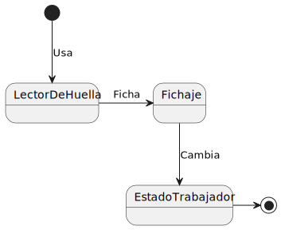
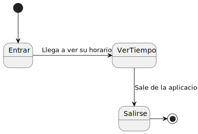

# Casos de Uso

## Identificación

### Actores
- Trabajador
- Usuario extiende Trabajador
- Administrador extiende Usuario
- Lector de Huellas

### Casos de Uso
- Lector de Huellas:
  - CREATE Fichaje Diario
  - READ Huella del Trabajador
  - UPDATE Fichaje Diario
 
- Trabajador:
  - Escanear Lector de Huella

- Usuario:
  - READ Fichaje Diario
  - READ Informe
    - READ Dia
    - READ Semana
    - READ Mes

- Administrador(Usuario):
  - CRUD Fichaje Diario
  - CRUD Informe
  - CRUD Usuario

## Priorización
1. Fichaje
2. Revisión de tiempo

## Detalles
- Fichaje: Cuando los trabajadores se fichan usando el tomador de huellas
- Revisión de tiempo: Cuando los trabajadores revisan cuanto tiempo han trabajado en un día y cuanto les falta por acabar.

## Diagrama 

Diagrama de Casos de Uso

- [Codigo PUML](../../modelosUML/casosDeUso/casosDeUso.puml)

Diagrama de Caso de Uso: Fichar

- [Codigo PUML](../../modelosUML/casosDeUso/CDU.Fichar.puml)

Diagrama de Caso de Uso: Revisar

- [Codigo PUML](../../modelosUML/casosDeUso/CDU.Fichar.puml)

