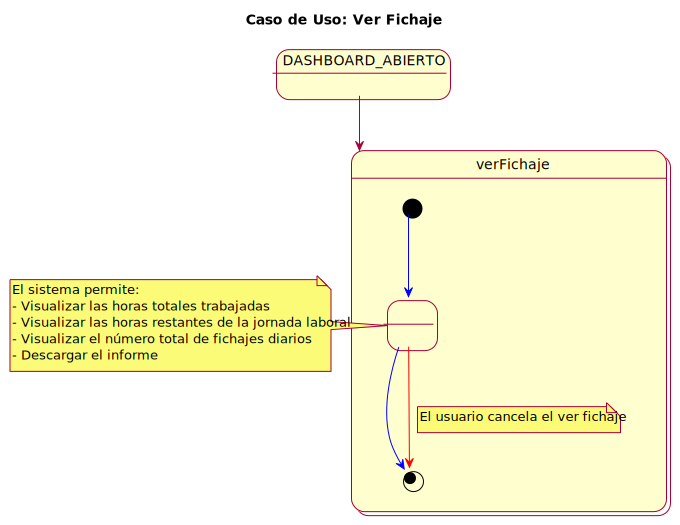
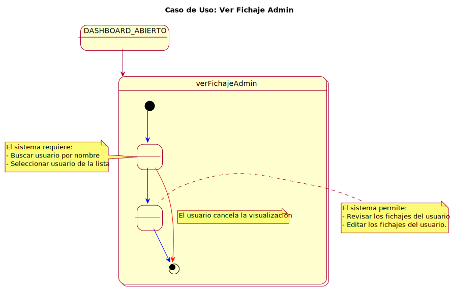
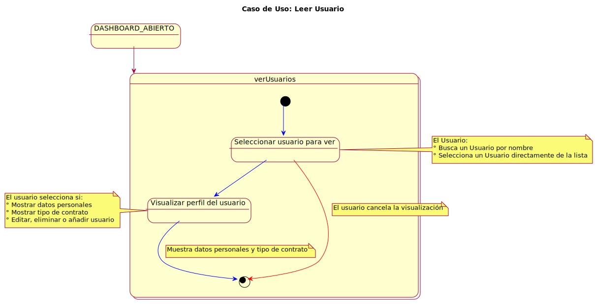

# Casos de Uso

## Identificación

### Actores
- Usuario
- Administrador (extiende de Usuario)

### Casos de Uso
#### Usuario:
  - READ Fichaje Diario
  - Informe
    - READ Dia
    - READ Semana
    - READ Mes

- Administrador (Usuario):
  - READ Fichaje Diario
  - UPDATE Fichaje Diario
  - READ Informe
  - CRUD Usuario

## Priorización
1. Fichaje
2. Revisión de tiempo

Casos de uso

|  |  |
| -- | -- |
|  | [Codigo PUML](../../modelosUML/casosDeUso/casosDeUso.puml) |

## Detalles
- Fichaje: Cuando se extrae del Lector de huellas los registros
- Revisión de tiempo: Cuando los trabajadores revisan cuanto tiempo han trabajado en un día, semana o mes y cuanto les falta para acabar.

Ver Fichaje

|  |  |
| -- | -- |
|  | [Codigo PUML](../../modelosUML/casosDeUso/detalles/verFichajeV2.puml) |
|  | [Codigo PUML](../../modelosUML/casosDeUso/detalles/verFichajeAdminV2.puml) |

Ver Informe

|  |  |
| -- | -- |
|  | [Codigo PUML](../../modelosUML/casosDeUso/detalles/verInformeV2.puml) |

Eliminar usuario (admin)

|  |  |
| -- | -- |
|  | [Codigo PUML](../../modelosUML/casosDeUso/detalles/eliminarUsuario.puml) |

Crear usuario (admin)

|  |  |
| -- | -- |
|  | [Codigo PUML](../../modelosUML/casosDeUso/detalles/crearUsuario.puml) |

Editar fichaje diario (admin)

|  |  |
| -- | -- |
|  | [Codigo PUML](../../modelosUML/casosDeUso/detalles/modificarFichajeV2.puml) | 

Ver usuario (admin)

|  |  |
| -- | -- |
|  | [Codigo PUML](../../modelosUML/casosDeUso/detalles/verUsuario.puml) |

Editar usuario (admin)

 
|  |  |
| -- | -- |
|  | [Codigo PUML](../../modelosUML/casosDeUso/detalles/editarUsuario.puml) |

Diagrama de contexto (admin)

|  |  |
| -- | -- |
| .svg) | [Codigo PUML](../../modelosUML/casosDeUso/diagramaContexto(admin).puml) |

Diagrama de contexto (usuario)

|  |  |
| -- | -- |
| .svg) | [Codigo PUML](../../modelosUML/casosDeUso/diagramaContexto(usuario).puml) |

