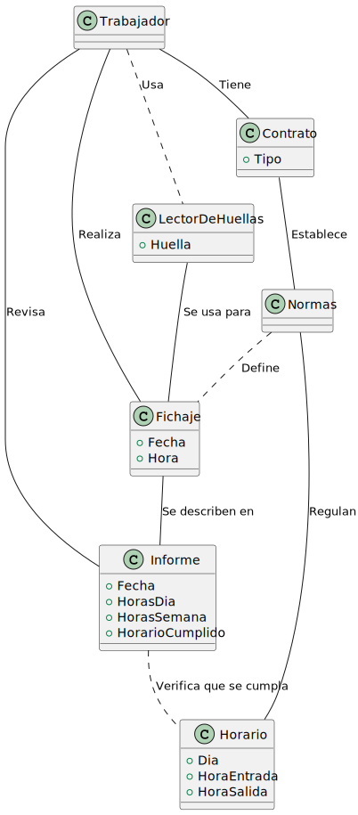
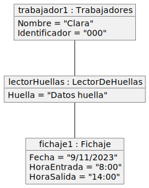
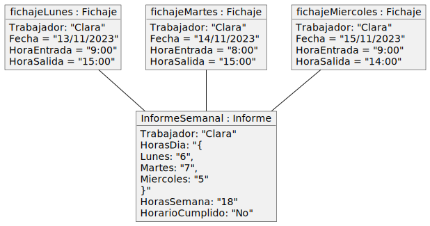
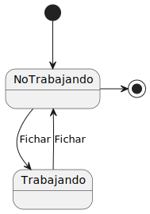

# Modelo del Dominio

Los objetos principales de nuestro dominio incluyen al trabajador, el lector de huellas, el fichaje, el informe, el contrato, las normas y el horario. A continuación podemos dividir el modelo dominio en diferentes diagramas.

En el primer componente, presentamos el **Diagrama de Clases** para entender las entidades del sistema y sus relaciones.

Diagrama de Clases

| Diagrama | Enlace PUML |
|-|-|
|  | [Codigo PUML](../../modelosUML/diagramaClases.puml) |

-----
En el segundo componente, el **Diagrama de Objetos**, mostramos situaciones específicas de interacción entre objetos. Dos ejemplos clave son el fichaje diario y la creación de un informe semanal.

Diagrama de Objetos

|Descripción|Diagrama|Enlace PUML|  
|--|--|--|
| Diagrama referido al crear un fichaje en el dia. |  | [Codigo PUML](../../modelosUML/diagramasObjetos/diagramaObjetos001.puml) |
| Diagrama referido al crear el informe semanal |  | [Codigo PUML](../../modelosUML/diagramasObjetos/diagramaObjetos002.puml) |
              

----
El tercer componente, el **Diagrama de Estados**, muestra las transiciones entre los estados fundamentales de un trabajador: trabajando y no trabajando.

Diagrama de Estados

|Diagrama|Enlace PUML|  
|--|--|
|  | [Codigo PUML](../../modelosUML/diagramaEstados.puml) |

