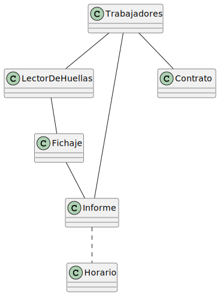

# Modelo del Dominio

Diagrama de Clases

  | Paso                                                                  |                         Detalle                         |
| --------------------------------------------------------------------- | :-----------------------------------------------------: |
| 1. Listar las clases conceptuales candidatas.                         | trabajadores, lector de huellas, fichaje, contrato, informe, horario, normas |
| 2. Representarlas en el modelo de dominio de partida.                 |                     |
| 3. Añadir las asociaciones necesarias para registrar las relaciones.  |                     |
| 4. Añadir los atributos que satisfagan los requisitos de información. |                     |
| 5. Añadir relación de normas para fichar definidas por el horario.    |                     |

- [Codigo PUML](../../modelosUML/diagramaClases.puml)

Diagrama de Objetos

|Descripción|Diagrama|Enlace PUML|  
|--|--|--|
| Diagrama referido al crear un fichaje en el dia. |  | [Codigo PUML](../../modelosUML/diagramasObjetos/diagramaObjetos001.puml) |
| Diagrama referido al crear el informe semanal |  | [Codigo PUML](../../modelosUML/diagramasObjetos/diagramaObjetos002.puml) |
              

Diagrama de Estados

|Descripción|Diagrama|Enlace PUML|  
|--|--|--|
| Se encuentra dos estados, si está trabajando o no |  | [Codigo PUML](https://github.com/VeronikaEspa/23-24-IdSw1-SDR/blob/develop/modelosUML/diagramaEstados.puml) |

<!-- 

Diagrama de Flujo

- Elemento 1
- Elemento 2
- Elemento 3

 -->
