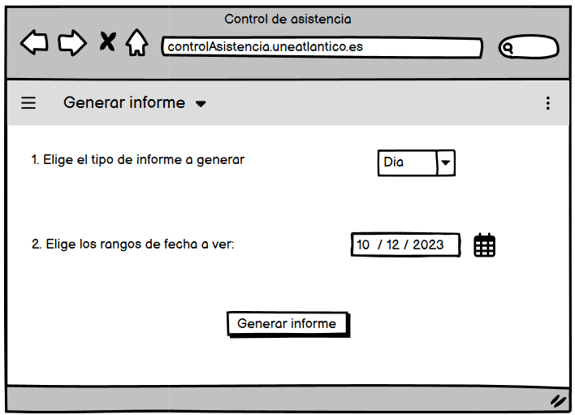
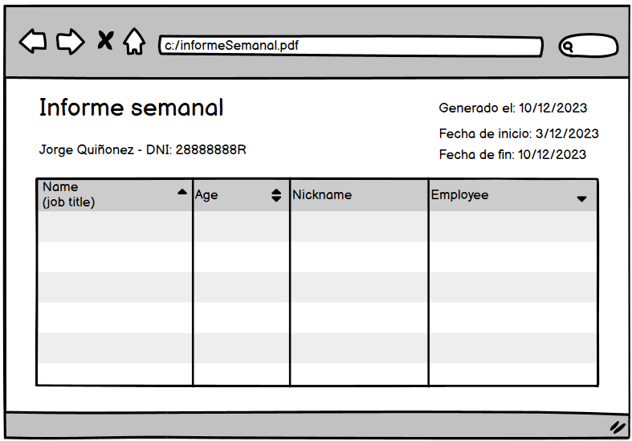
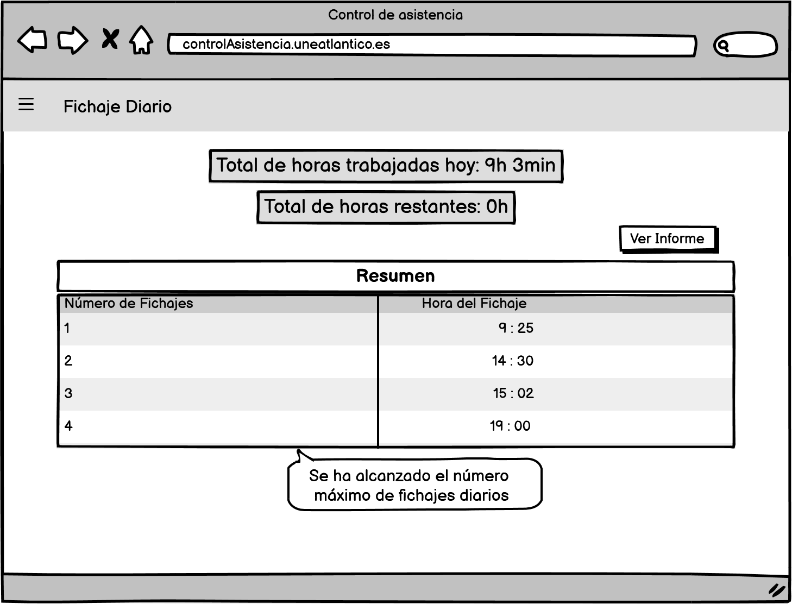

# Prototipos

Ver Fichaje

|  |  |
| -- | -- |
|  | [Codigo PUML](../../modelosUML/casosDeUso/detalles/verFichaje.puml) |

Ver Informe

|  |
| -- |
|  |
|  |

 Ver Fichaje Diario 

|  |
| -- |
|  |

Diagrama de contexto con Prototipos

|  |  |
| -- | -- |
|  | [Codigo PUML](../../modelosUML/prototipos/contexto.puml) |

