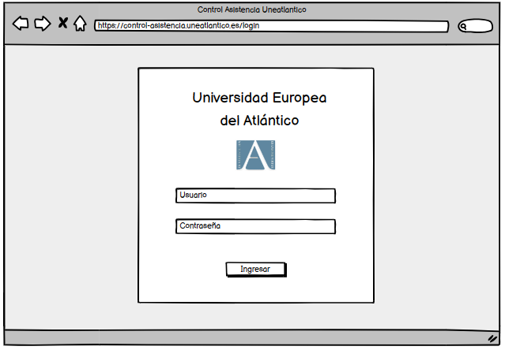
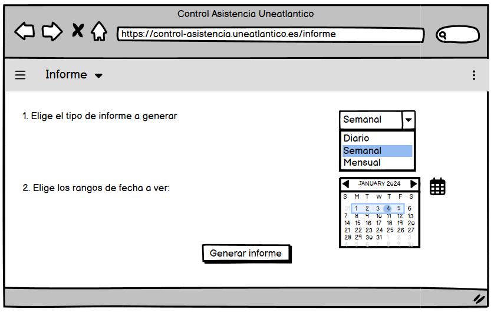
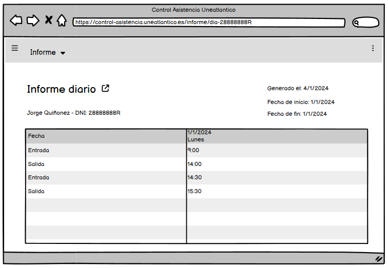
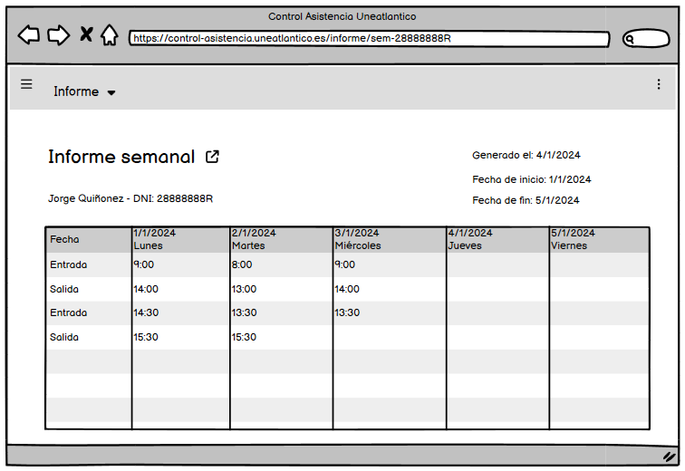
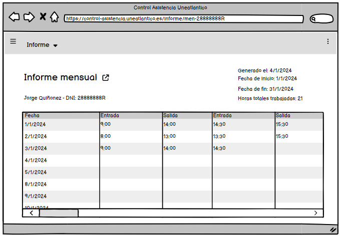
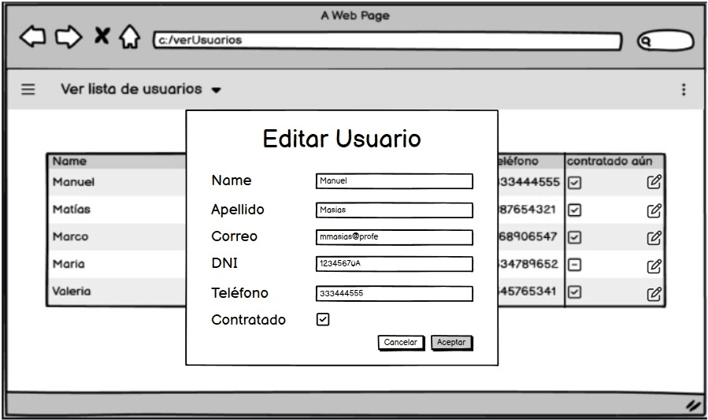
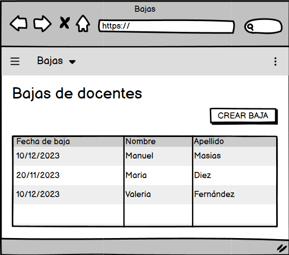
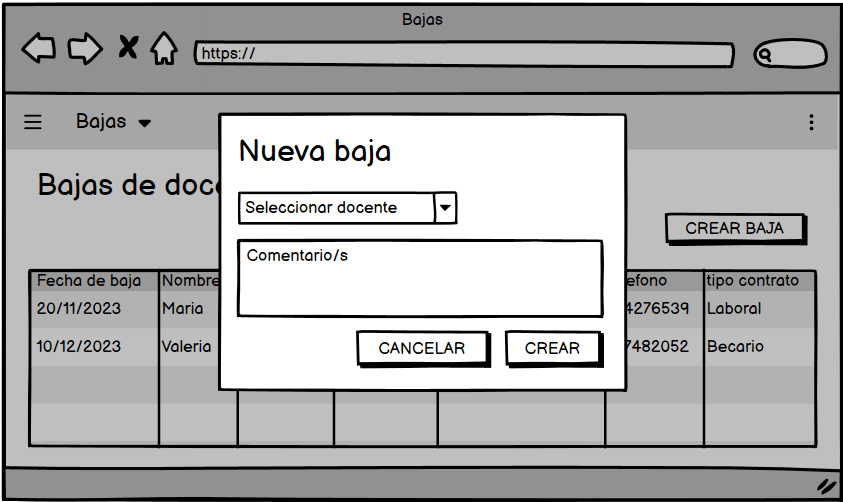
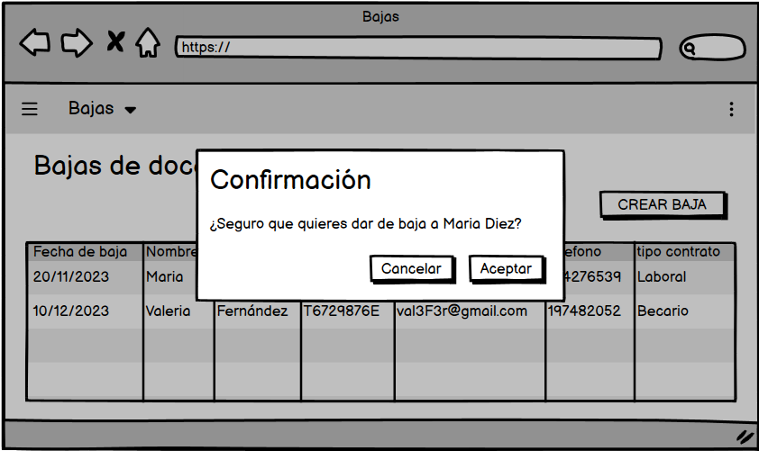

# Prototipos

login

| | |
| -- | -- |
|  |  |

Ver Informe

| | |
| -- | -- |
| Seleccion de tipo de informe |  |
| Informe Diario |  |
| Informe Semanal |  |
| Informe Mensual |  |

 Ver Fichaje Diario 

 Ver Usuarios 

|  |
| -- |
| .png) |

Opciones tras seleccionar un usuario:

|  |
| -- |
| .png) |

Crear Usuarios

Editar Usuarios

Eliminar Usuarios

### Vista

### Formulario

### Confirmación

Diagrama de flujo prototipos (usuario)

|  |
| -- |
|  |

