# Casos de Uso

## Índice

1. [Actores y Casos de Uso](#actores-y-casos-de-uso)
2. [Detalles de los Casos de Uso](#detalles-de-los-casos-de-uso)
3. [Diagrama de Contexto](#diagrama-de-contexto)
4. [Prototipo interfaz FISC](#prototipo-interfaz-fisc)
5. [Mapa de flujo pantallas](#mapa-de-flujo-pantallas)

## Actores y Casos de Uso

### Actores

- Usuario_no_registrado
- Usuario
- Tiempo

### Casos de uso

#### - Inicio Sesión

Los usuarios pueden registrarse o iniciar sesión. 

|                                               |                                                 |
| --------------------------------------------- | ----------------------------------------------- |
|  | [Código PUML](../casosDeUso/casoUsoInicio.puml) |

#### - Estado Principal

Permite al usuario crear, importar, exportar o abrir proyectos.

|                                                        |                                                          |
| ------------------------------------------------------ | -------------------------------------------------------- |
| 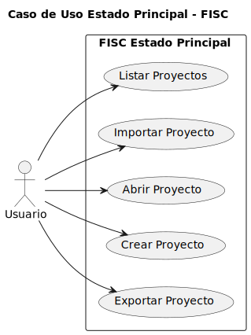 | [Código PUML](../casosDeUso/casoUsoEstadoPrincipal.puml) |

#### - Estado Proyecto

Ofrece opciones para abrir o crear nuevas simulaciones y ver reportes de simulaciones existentes.

|                                                       |                                                         |
| ----------------------------------------------------- | ------------------------------------------------------- |
| 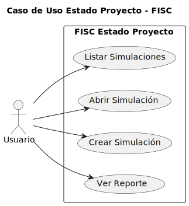 | [Código PUML](../casosDeUso/casoUsoEstadoProyecto.puml) |

#### - Configuración de Simulación

Permite importar configuraciones de simulación y empezar una nueva simulación.

|                                                                  |                                                                    |
| ---------------------------------------------------------------- | ------------------------------------------------------------------ |
|  | [Código PUML](../casosDeUso/casoUsoConfiguracionDeSimulacion.puml) |

#### - Simulando

Muestra el estado de la simulación en curso con la opción de cancelar.

|                                                  |                                                    |
| ------------------------------------------------ | -------------------------------------------------- |
|  | [Código PUML](../casosDeUso/casoUsoSimulando.puml) |

#### - Reporte

Permite editar simulaciones, exportar, imprimir y guardar reportes.

|                                                |                                                  |
| ---------------------------------------------- | ------------------------------------------------ |
|  | [Código PUML](../casosDeUso/casoUsoReporte.puml) |

#### - Log

Accesible desde cualquier pantalla, muestra el registro detallado de las acciones realizadas en la aplicación.

|                                            |                                              |
| ------------------------------------------ | -------------------------------------------- |
|  | [Código PUML](../casosDeUso/casoUsoLog.puml) |

#### - General

Incluye opciones para acceder al log y cerrar la sesión en la aplicación.

|                                                |                                                  |
| ---------------------------------------------- | ------------------------------------------------ |
|  | [Código PUML](../casosDeUso/casoUsoGeneral.puml) |

---

## Detalles de los Casos de Uso

#### - Login

|                                                                        |                                                                          |
| ---------------------------------------------------------------------- | ------------------------------------------------------------------------ |
|  | [Código PUML](../casosDeUso/detallesCasosUso/detalleCasoUsoLogin.puml) |

#### - Registrar Usuario

|                                                                        |                                                                          |
| ---------------------------------------------------------------------- | ------------------------------------------------------------------------ |
| 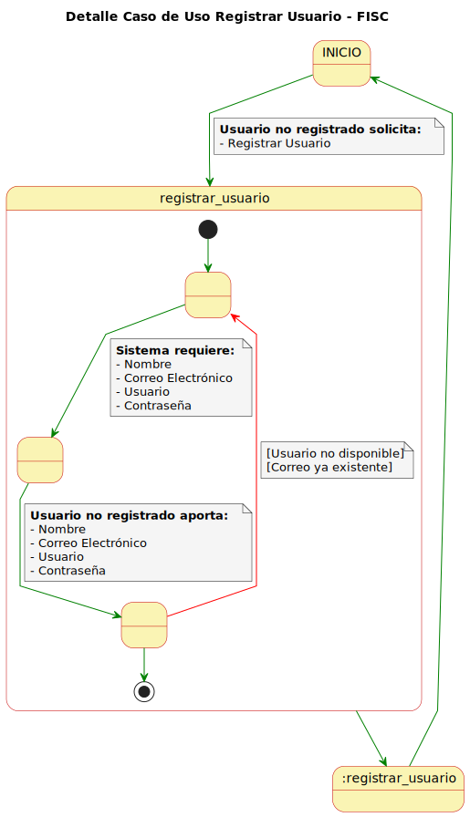 | [Código PUML](../casosDeUso/detallesCasosUso/detalleCasoUsoRegistrarUsuario.puml) |

#### - Listar Proyectos

|                                                                        |                                                                          |
| ---------------------------------------------------------------------- | ------------------------------------------------------------------------ |
| 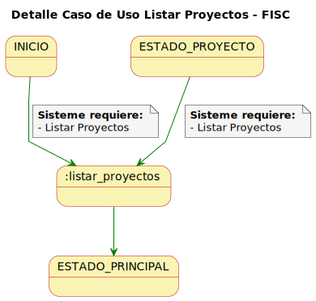 | [Código PUML](../casosDeUso/detallesCasosUso/detalleCasoUsoListarProyectos.puml) |

#### - Crear Proyecto

|                                                                        |                                                                          |
| ---------------------------------------------------------------------- | ------------------------------------------------------------------------ |
| 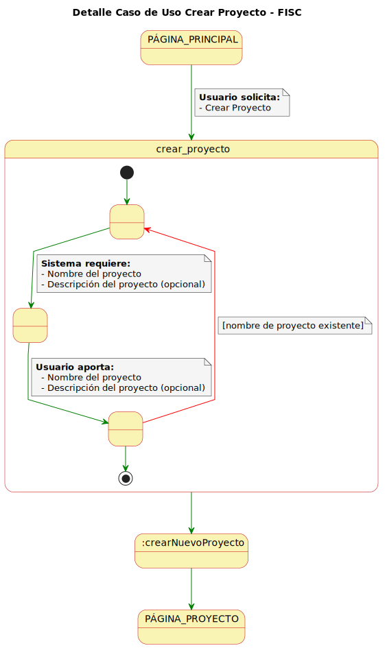 | [Código PUML](../casosDeUso/detallesCasosUso/detalleCasoUsoCrearProyecto.puml) |

#### - Abrir Proyecto

|                                                                        |                                                                          |
| ---------------------------------------------------------------------- | ------------------------------------------------------------------------ |
| 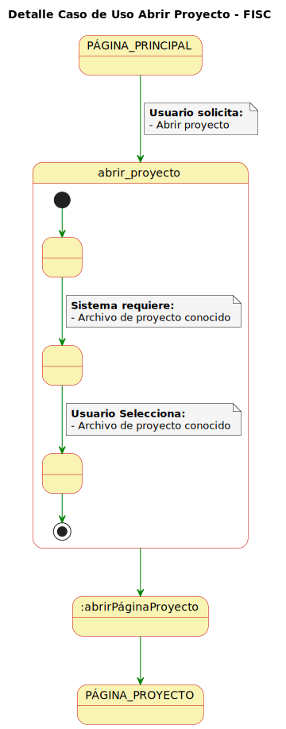 | [Código PUML](../casosDeUso/detallesCasosUso/detalleCasoUsoAbrirProyecto.puml) |

#### - Importar Proyecto

|                                                                        |                                                                          |
| ---------------------------------------------------------------------- | ------------------------------------------------------------------------ |
| 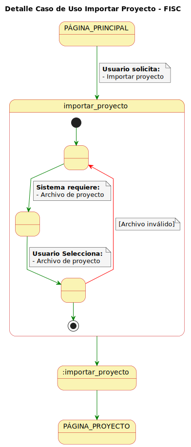 | [Código PUML](../casosDeUso/detallesCasosUso/detalleCasoUsoImportarProyecto.puml) |

#### - Exportar Proyecto

|                                                                        |                                                                          |
| ---------------------------------------------------------------------- | ------------------------------------------------------------------------ |
| 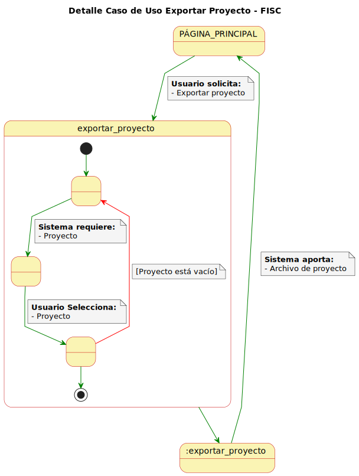 | [Código PUML](../casosDeUso/detallesCasosUso/detalleCasoUsoExportarProyecto.puml) |

#### - Listar Simulaciones

|                                                                        |                                                                          |
| ---------------------------------------------------------------------- | ------------------------------------------------------------------------ |
| 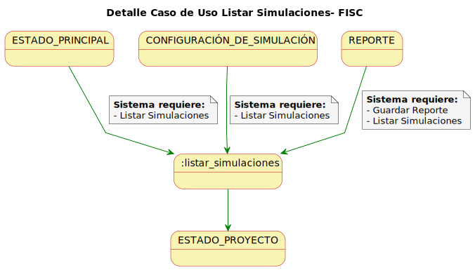 | [Código PUML](../casosDeUso/detallesCasosUso/detalleCasoUsoListarSimulaciones.puml) |

#### - Crear Simulación

|                                                                        |                                                                          |
| ---------------------------------------------------------------------- | ------------------------------------------------------------------------ |
| 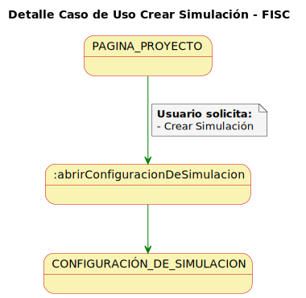 | [Código PUML](../casosDeUso/detallesCasosUso/detalleCasoUsoCrearSimulacion.puml) |

#### - Abrir Simulación

|                                                                        |                                                                          |
| ---------------------------------------------------------------------- | ------------------------------------------------------------------------ |
| 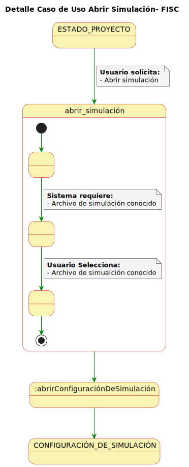 | [Código PUML](../casosDeUso/detallesCasosUso/detalleCasoUsoAbrirSimulación.puml) |

#### - Ver Reporte

|                                                                        |                                                                          |
| ---------------------------------------------------------------------- | ------------------------------------------------------------------------ |
| 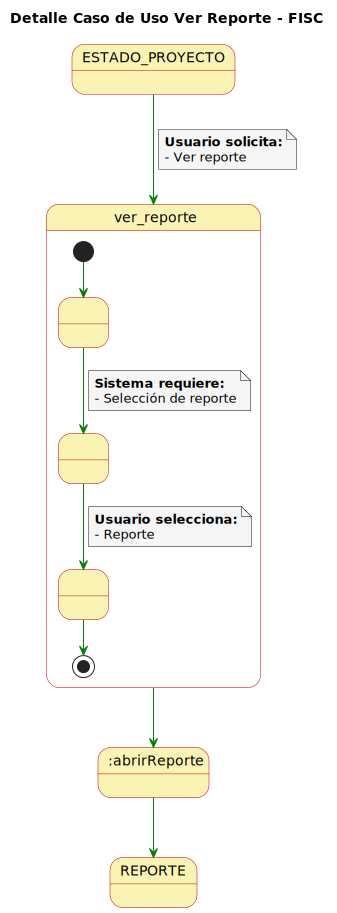 | [Código PUML](../casosDeUso/detallesCasosUso/detalleCasoUsoVerReporte.puml) |

#### - Importar Simulación

|                                                                        |                                                                          |
| ---------------------------------------------------------------------- | ------------------------------------------------------------------------ |
| 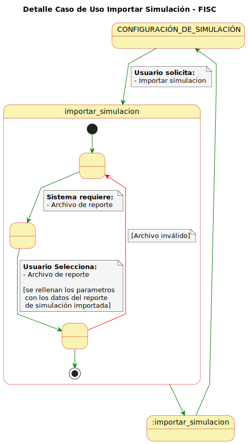 | [Código PUML](../casosDeUso/detallesCasosUso/detalleCasoUsoImportarSimulación.puml) |

#### - Iniciar Simulación

|                                                                        |                                                                          |
| ---------------------------------------------------------------------- | ------------------------------------------------------------------------ |
| 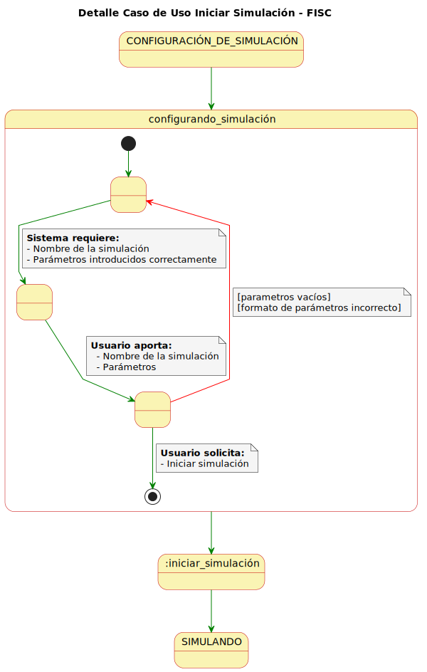 | [Código PUML](../casosDeUso/detallesCasosUso/detalleCasoUsoIniciarSimulación.puml) |

#### - Cancelar Simulación

|                                                                        |                                                                          |
| ---------------------------------------------------------------------- | ------------------------------------------------------------------------ |
| 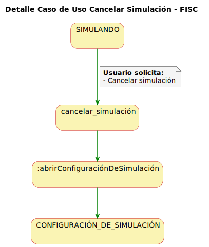 | [Código PUML](../casosDeUso/detallesCasosUso/detalleCasoUsoCancelarSimulacion.puml) |

#### - Verificar Estado de Simulación

|                                                                        |                                                                          |
| ---------------------------------------------------------------------- | ------------------------------------------------------------------------ |
| 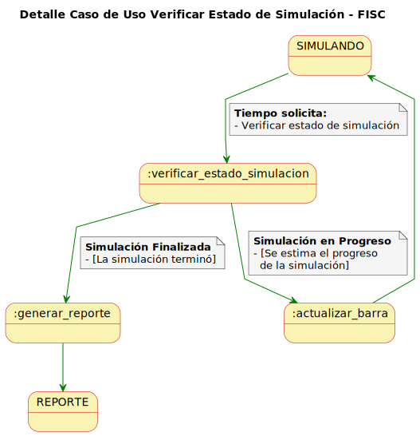 | [Código PUML](../casosDeUso/detallesCasosUso/detalleCasoUsoVerificarEstadoSimulacion.puml) |

#### - Editar Simulación

|                                                                        |                                                                          |
| ---------------------------------------------------------------------- | ------------------------------------------------------------------------ |
| 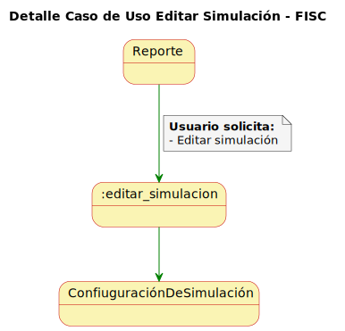 | [Código PUML](../casosDeUso/detallesCasosUso/detalleCasoUsoEditarSimulacion.puml) |

#### - Exportar Reporte

|                                                                        |                                                                          |
| ---------------------------------------------------------------------- | ------------------------------------------------------------------------ |
| 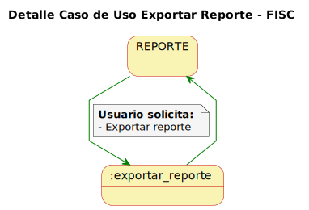 | [Código PUML](../casosDeUso/detallesCasosUso/detalleCasoUsoExportarReporte.puml) |

#### - Imprimir Reporte

|                                                                        |                                                                          |
| ---------------------------------------------------------------------- | ------------------------------------------------------------------------ |
| 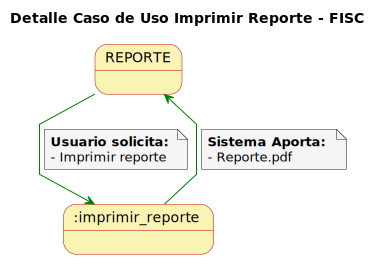 | [Código PUML](../casosDeUso/detallesCasosUso/detalleCasoUsoImprimirReporte.puml) |

#### - Guardar Reporte

|                                                                        |                                                                          |
| ---------------------------------------------------------------------- | ------------------------------------------------------------------------ |
| 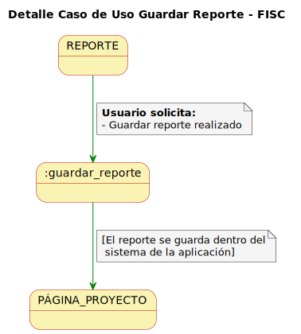 | [Código PUML](../casosDeUso/detallesCasosUso/detalleCasoUsoGuardarReporte.puml) |

#### - Imprimir Log

|                                                                        |                                                                          |
| ---------------------------------------------------------------------- | ------------------------------------------------------------------------ |
| 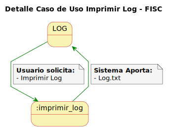 | [Código PUML](../casosDeUso/detallesCasosUso/detalleCasoUsoImprimirLog.puml) |

#### - Abrir Log

|                                                                        |                                                                          |
| ---------------------------------------------------------------------- | ------------------------------------------------------------------------ |
| 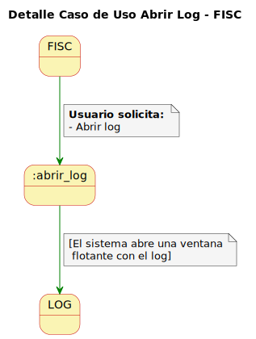 | [Código PUML](../casosDeUso/detallesCasosUso/detalleCasoUsoAbrirLog.puml) |

#### - Cerrar Log

|                                                                        |                                                                          |
| ---------------------------------------------------------------------- | ------------------------------------------------------------------------ |
| 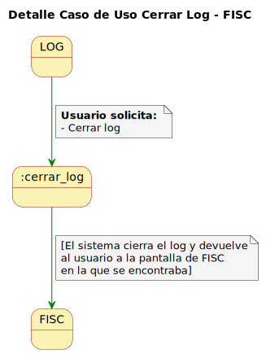 | [Código PUML](../casosDeUso/detallesCasosUso/detalleCasoUsoCerrarLog.puml) |

#### - Cerrar Sesión

|                                                                        |                                                                          |
| ---------------------------------------------------------------------- | ------------------------------------------------------------------------ |
| 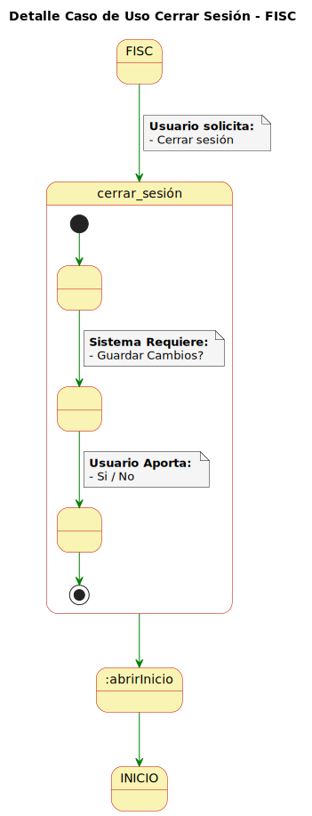 | [Código PUML](../casosDeUso/detallesCasosUso/detalleCasoUsoCerrarSesion.puml) |

---

## Diagrama de Contexto

|                                                    |                                                    |
| -------------------------------------------------- | -------------------------------------------------- |
|  | [Código PUML](../casosDeUso/diagramaContexto.puml) |

---

## Prototipo interfaz FISC
Cada una de las pantallas que implementan las funcionalidades de la aplicación.

### Pantalla inicio

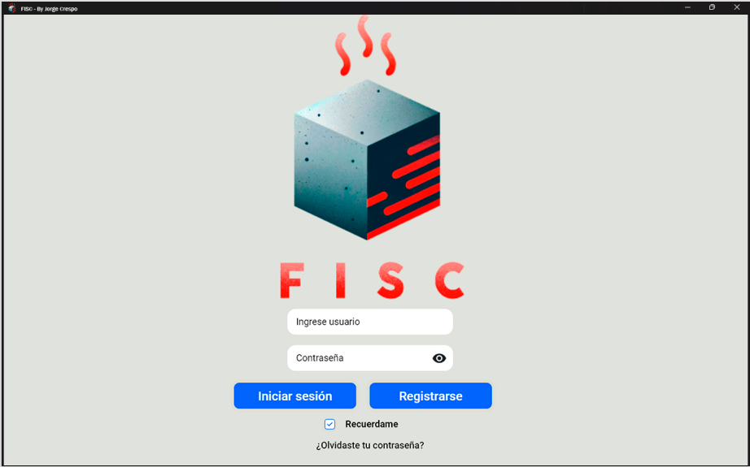

### Pantalla carga

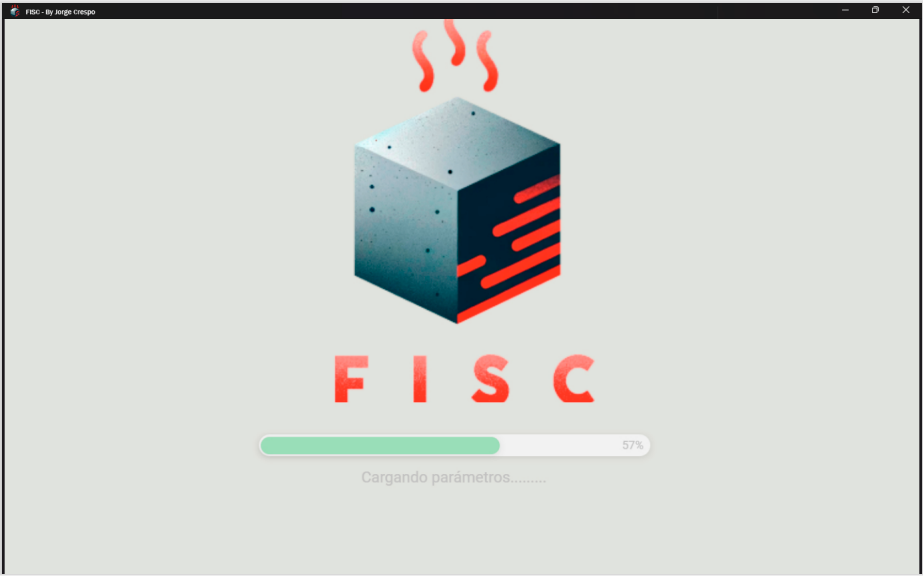

### Pantalla principal

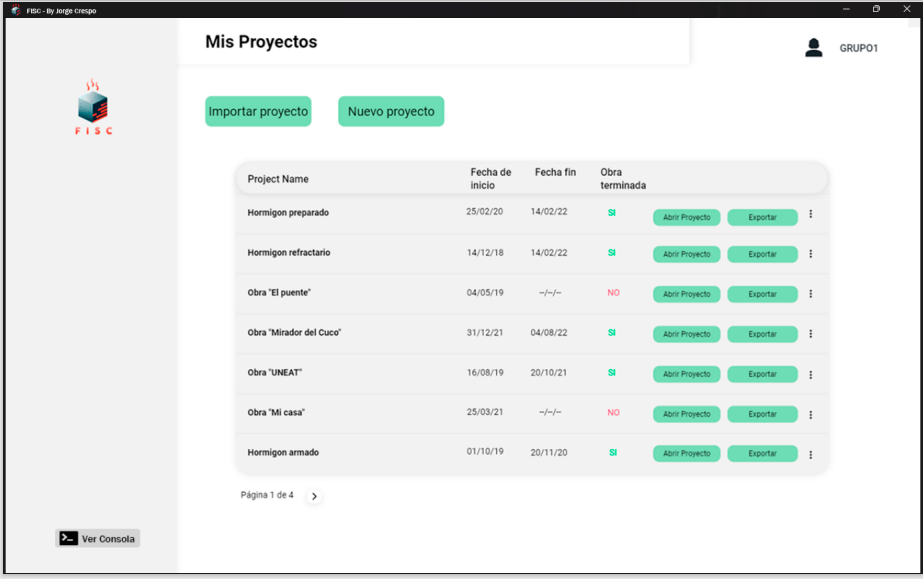

### Pantalla Nuevo proyecto

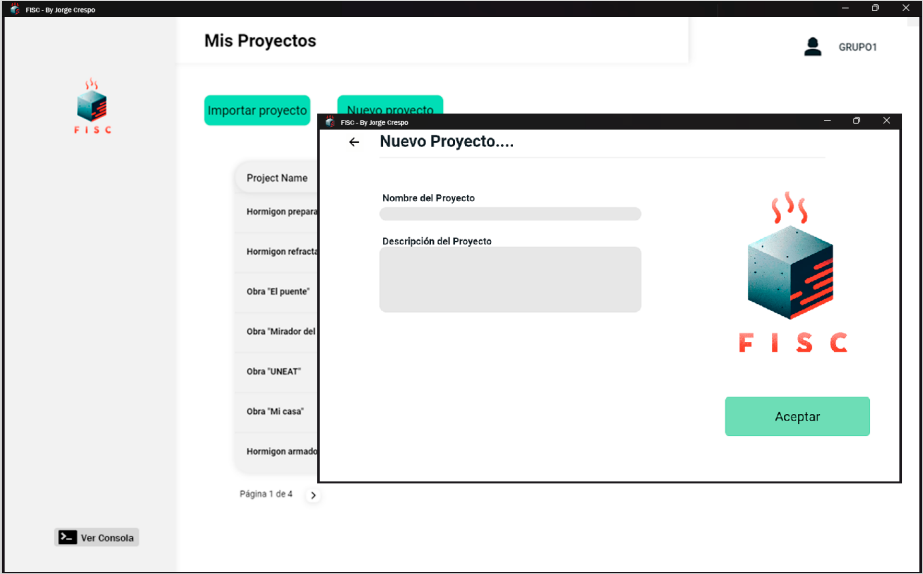

### Pantalla proyecto vacío

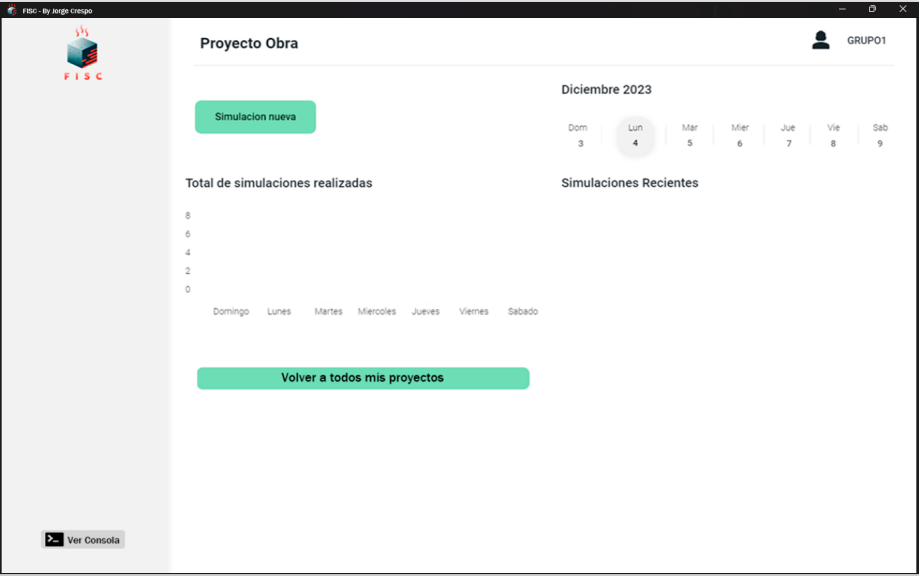

### Pantalla proyecto con simulaciones realizadas 

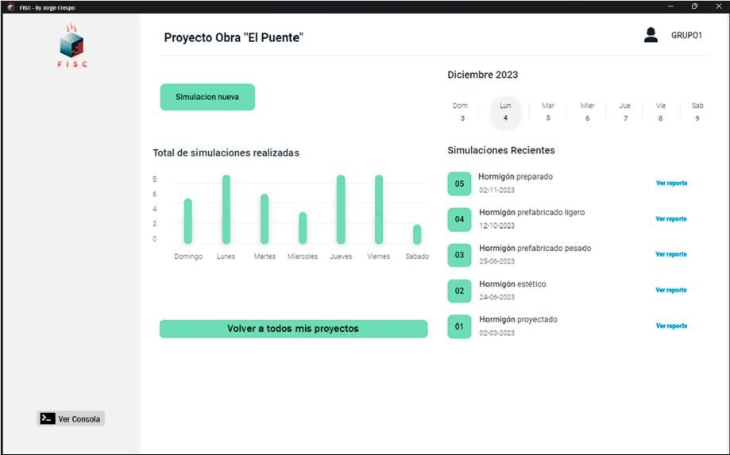

### Pantalla de configuración de simulación

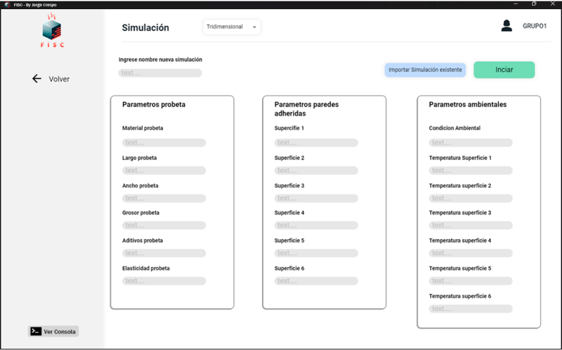

### Pantalla de simulando

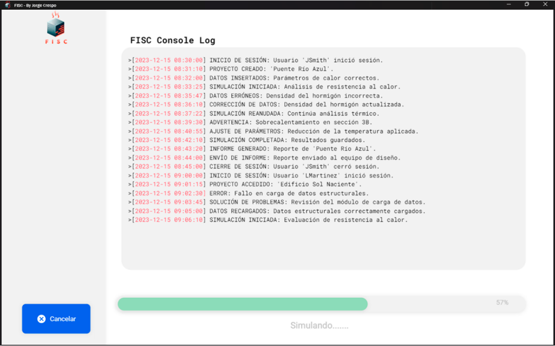

### Pantalla de reporte

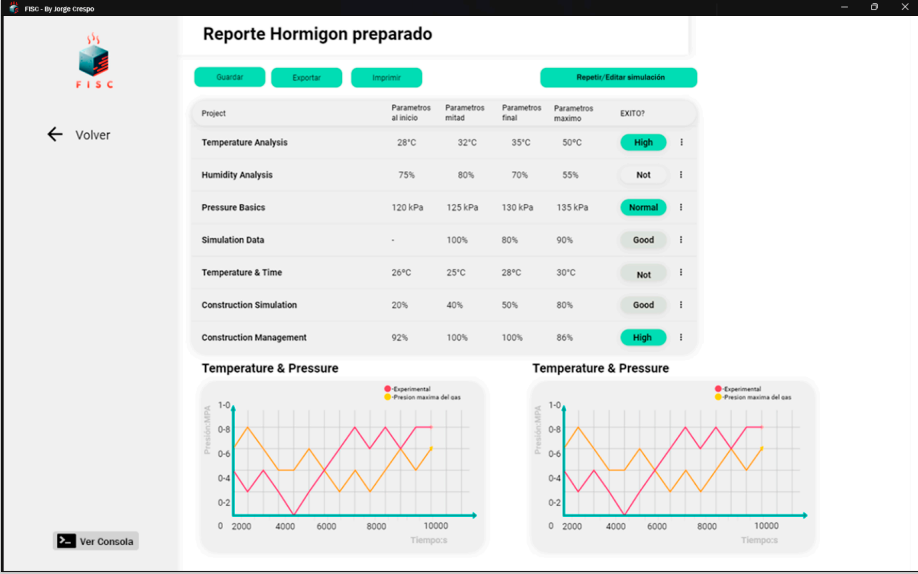

### Pantalla log

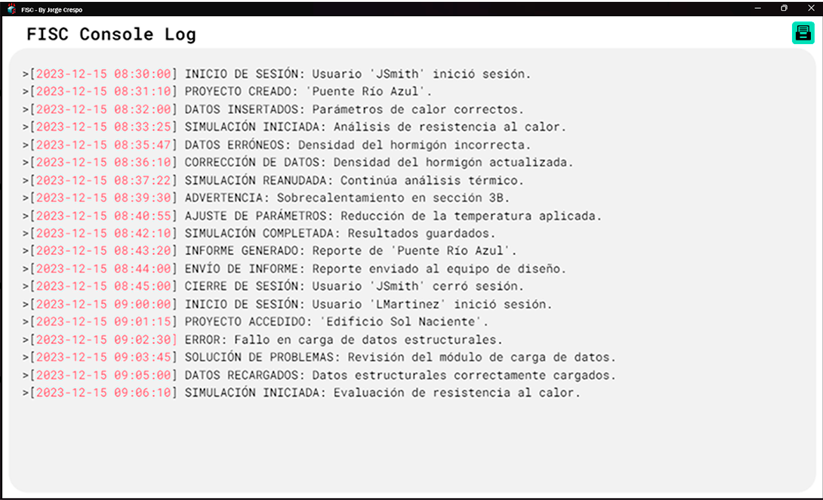

---

## Mapa de flujo pantallas
Mapa de navegación de la aplicación.

