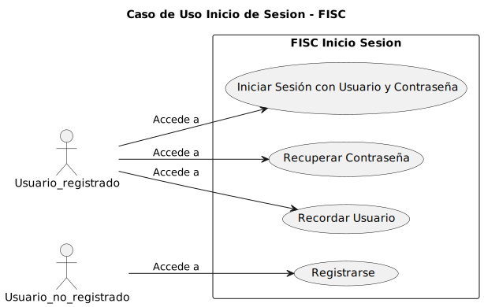
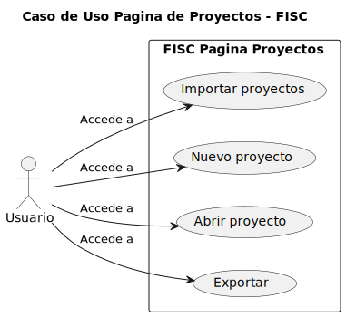

# Casos de Uso

## Identificación

### Actores
- Usuario
- Tiempo

## Detalles

### - Inicio Sesión

Los usuarios pueden registrarse o iniciar sesión. Incluye una opción para recuperar la cuenta en caso de olvido de datos y para recordar usuario

|  |  |
| -- | -- |
|  | [Codigo PUML](../casosDeUso/casoUsoInicioSesion.puml) |

### - Página Proyectos

Permite al usuario crear, importar, exportar o abrir proyectos, y ofrece un acceso directo al log de la aplicación

|  |  |
| -- | -- |
|  | [Codigo PUML](../casosDeUso/casoUsoPaginaProyectos.puml) |

### - Nuevo Proyecto

El usuario puede asignar un nombre y descripción al nuevo proyecto con opciones de cancelar la creación del proyecto y crearlo

|  |  |
| -- | -- |
|  | [Codigo PUML](../casosDeUso/casoUsoNuevoProyecto.puml) |

### - Página Proyecto

Ofrece opciones para acceder al log, volver a la página de proyectos, crear nuevas simulaciones y ver simulaciones recientes

|  |  |
| -- | -- |
|  | [Codigo PUML](../casosDeUso/casoUsoPaginaProyecto.puml) |

### - Simulación

El usuario introduce los datos de la probeta y elige entre simulación bidimensional o tridimensional, con la opción de importar parámetros adicionales

|  |  |
| -- | -- |
|  | [Codigo PUML](../casosDeUso/casoUsoSimulacion.puml) |

### - Pantalla Carga

Tiempo real del proceso de simulación, con opción de cancelar a mitad de camino

|  |  |
| -- | -- |
|  | [Codigo PUML](../casosDeUso/casoUsoPantallaCarga.puml) |

### - Ver Reporte

Opciones para guardar, exportar, imprimir el reporte, o repetir la simulación editando los datos

|  |  |
| -- | -- |
|  | [Codigo PUML](../casosDeUso/casoUsoReporte.puml) |

### - Log

Accesible desde cualquier pantalla, muestra el registro detallado de las acciones realizadas en la aplicación

|  |  |
| -- | -- |
|  | [Codigo PUML](../casosDeUso/casoUsoLog.puml) |