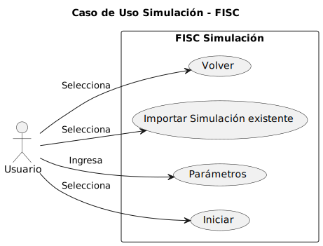
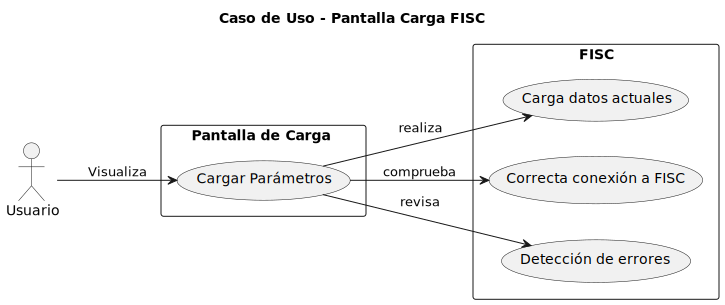

# Casos de Uso

## Índice
1. [Actores y Casos de Uso](#actores-y-casos-de-uso)
2. [Detalles de los Casos de Uso](#detalles-de-los-casos-de-uso)
3. [Diagramas de Contexto](#diagramas-de-contexto)

## Actores y Casos de Uso

### Actores

- Usuario_no_registrado
- Usuario
- Tiempo

### Casos de uso

#### - Inicio Sesión

Los usuarios pueden registrarse o iniciar sesión. Incluye una opción para recuperar la cuenta en caso de olvido de datos y para recordar usuario

|  |  |
| -- | -- |
|  | [Codigo PUML](../casosDeUso/casoUsoInicioSesión.puml) |

#### - Página Usuario

Permite al usuario crear, importar, exportar o abrir proyectos, y ofrece un acceso directo al log de la aplicación

|  |  |
| -- | -- |
|  | [Codigo PUML](../casosDeUso/casoUsoPaginaPricipal.puml) |

#### - Página Proyecto

Ofrece opciones para acceder al log, volver a la página de proyectos, crear nuevas simulaciones y ver simulaciones recientes

|  |  |
| -- | -- |
|  | [Codigo PUML](../casosDeUso/casoUsoPaginaProyecto.puml) |

#### - Simulación

El usuario introduce los datos de la probeta y elige entre simulación bidimensional o tridimensional, con la opción de importar parámetros adicionales

|  |  |
| -- | -- |
|  | [Codigo PUML](../casosDeUso/casoUsoSimulacion.puml) |

#### - Pantalla Carga

Tiempo real del proceso de simulación, con opción de cancelar a mitad de camino

|  |  |
| -- | -- |
|  | [Codigo PUML](../casosDeUso/casoUsoPantallaCarga.puml) |

#### - Ver Reporte

Opciones para guardar, exportar, imprimir el reporte, o repetir la simulación editando los datos

|  |  |
| -- | -- |
|  | [Codigo PUML](../casosDeUso/casoUsoReporte.puml) |

#### - Log

Accesible desde cualquier pantalla, muestra el registro detallado de las acciones realizadas en la aplicación

|  |  |
| -- | -- |
|  | [Codigo PUML](../casosDeUso/casoUsoLog.puml) |

---

## Detalles de los Casos de Uso

#### - Detalle Caso Uso Inicial

|  |  |
| -- | -- |
|  | [Codigo PUML](../casosDeUso/detallesCasosUso/detalleCasoUsoInicial.puml) |

---

## Diagramas de Contexto

|  |  |
| -- | -- |
|  | [Codigo PUML](../casosDeUso/diagramaContexto.puml) |
