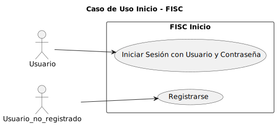
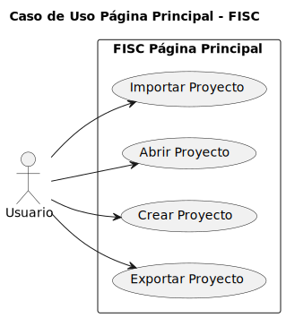
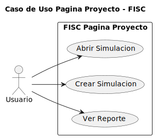
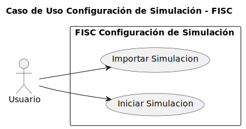
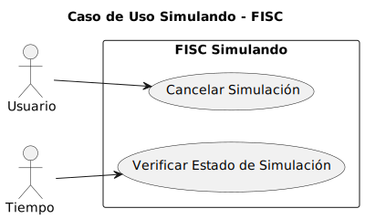
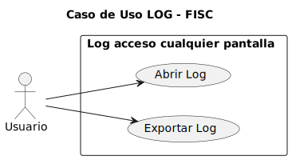
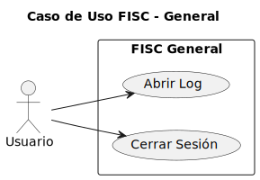
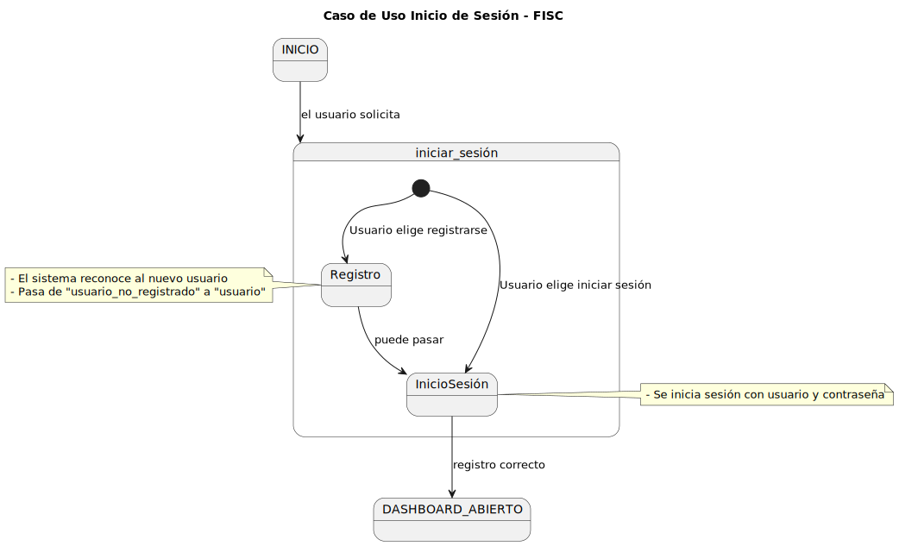
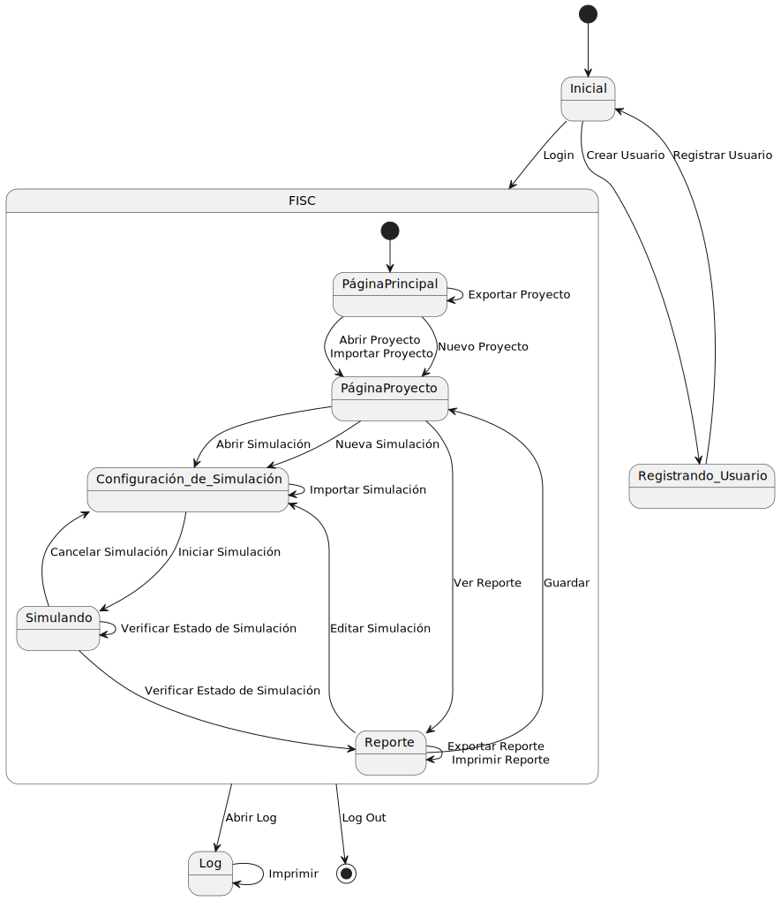

# Casos de Uso

## Índice

1. [Actores y Casos de Uso](#actores-y-casos-de-uso)
2. [Detalles de los Casos de Uso](#detalles-de-los-casos-de-uso)
3. [Diagramas de Contexto](#diagramas-de-contexto)

## Actores y Casos de Uso

### Actores

- Usuario_no_registrado
- Usuario
- Tiempo

### Casos de uso

#### - Inicio Sesión

Los usuarios pueden registrarse o iniciar sesión. Incluye una opción para recuperar la cuenta en caso de olvido de datos y para recordar usuario

|                                               |                                                 |
| --------------------------------------------- | ----------------------------------------------- |
|  | [Código PUML](../casosDeUso/casoUsoInicio.puml) |

#### - Página Principal

Permite al usuario crear, importar, exportar o abrir proyectos.

|                                                        |                                                          |
| ------------------------------------------------------ | -------------------------------------------------------- |
|  | [Código PUML](../casosDeUso/casoUsoPaginaPrincipal.puml) |

#### - Página Proyecto

Ofrece opciones para abrir o crear nuevas simulaciones y ver reportes de simulaciones existentes.

|                                                       |                                                         |
| ----------------------------------------------------- | ------------------------------------------------------- |
|  | [Código PUML](../casosDeUso/casoUsoPaginaProyecto.puml) |

#### - Configuración de Simulación

Permite importar configuraciones de simulación y empezar una nueva simulación.

|                                                                  |                                                                    |
| ---------------------------------------------------------------- | ------------------------------------------------------------------ |
|  | [Código PUML](../casosDeUso/casoUsoConfiguracionDeSimulacion.puml) |

#### - Simulando

Muestra el estado de la simulación en curso con la opción de cancelar.

|                                                  |                                                    |
| ------------------------------------------------ | -------------------------------------------------- |
|  | [Código PUML](../casosDeUso/casoUsoSimulando.puml) |

#### - Reporte

Permite editar simulaciones, exportar, imprimir y guardar reportes.

|                                                |                                                  |
| ---------------------------------------------- | ------------------------------------------------ |
|  | [Código PUML](../casosDeUso/casoUsoReporte.puml) |

#### - Log

Accesible desde cualquier pantalla, muestra el registro detallado de las acciones realizadas en la aplicación.

|                                            |                                              |
| ------------------------------------------ | -------------------------------------------- |
|  | [Código PUML](../casosDeUso/casoUsoLog.puml) |

#### - General

Incluye opciones para acceder al log y cerrar la sesión en la aplicación.

|                                                |                                                  |
| ---------------------------------------------- | ------------------------------------------------ |
|  | [Código PUML](../casosDeUso/casoUsoGeneral.puml) |

---

## Detalles de los Casos de Uso

#### - Detalle Caso Uso Inicial

|                                                                        |                                                                          |
| ---------------------------------------------------------------------- | ------------------------------------------------------------------------ |
|  | [Código PUML](../casosDeUso/detallesCasosUso/detalleCasoUsoInicial.puml) |

---

## Diagramas de Contexto

|                                                    |                                                    |
| -------------------------------------------------- | -------------------------------------------------- |
|  | [Código PUML](../casosDeUso/diagramaContexto.puml) |
